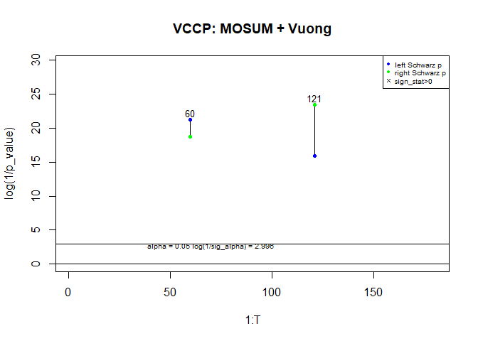

Readme file of VCCP package
================

<!-- README.md is generated from README.Rmd. Please edit that file -->

# VCCP

<!-- badges: start -->
<!-- badges: end -->

The goal of VCCP is to implement Vine Copula Change Points (VCCP) model
to estimate the number and location of multiple change points in the
functional connectivity structure of multivariate time series. Possible
binary segmentation methods of the VCCP model include NBS, OBS, MOSUM,
and WBS. You can also check the significance of detected candidates by
Stationary Bootstrap or Vuong test method.

## Installation

You can install the released version of VCCP from
[CRAN](https://CRAN.R-project.org) with:

``` r
install.packages("VCCP")
```

And the development version from [GitHub](https://github.com/) with:

``` r
# install.packages("devtools")
devtools::install_github("xinxiong0238/VCCP")
```

## Example

These are some basic examples which show you how to detect changes in
the functional connectivity of multivariate time series using different
binary segmentation methods and inference tests.

``` r
library(vccp)
## basic example code
data <- cbind(1:180, mvn.sim.2.cps(180, 8, seed = 101))
T <- 180

result.NV <- vccp.fun(data, method = "NBS", delta = 30, test = "V")
#> Binary search, round 1 ...
#> Binary search, round 2 ...
#> Binary search, round 3 ...
#> Perform Vuong test on candidates...
getTestPlot(result.NV)
title("VCCP: NBS + Vuong")
```


``` r
result.NB <- vccp.fun(data, method = "NBS", delta = 30, test = "B")
#> Binary search, round 1 ...
#> Binary search, round 2 ...
#> Binary search, round 3 ...
#> Perform stationary bootstrap test on candidates...
getTestPlot(result.NB)
title("VCCP: NBS + Stationary Bootstrap")
```


``` r
result.MV <- vccp.fun(data, method = "MOSUM", delta = 30, test = "V")
#> MOSUM search ...
#> Perform Vuong test on candidates...
```


``` r
getTestPlot(result.MV)
title("VCCP: MOSUM + Vuong")
```



``` r
result.MB <- vccp.fun(data, method = "MOSUM", delta = 30, test = "B")
#> MOSUM search ...
#> Perform stationary bootstrap test on candidates...
```


``` r
getTestPlot(result.MB)
title("VCCP: MOSUM + Stationary Bootstrap")
```


